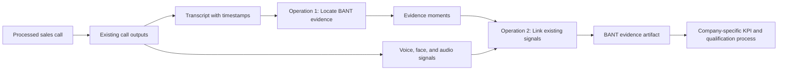

# Architecture: BANT Evidence Extraction

## Purpose

This architecture describes how to extract BANT information from an already-processed sales call:

- Budget
- Authority
- Need
- Timeline

The system only extracts information. It does not decide whether the lead is qualified, whether a criterion is satisfied, or what any signal means. Each company has its own qualification criteria and KPIs. The system's responsibility is to provide the relevant information and evidence in a consistent, auditable form.

## Scope

The call has already passed through the existing analysis pipeline. The following information is already available:

- Speaker-labelled transcript with timestamps
- Audio signals for transcript segments
- Voice signals for transcript segments
- Facial signals for sampled moments

The BANT process reuses these outputs. It does not record the call again and does not run the signal-extraction pipeline again.

## Conceptual Flow

```text
+-----------------------+
|   Processed call      |
+-----------+-----------+
            |
            v
+-----------------------+
| Existing call outputs |
|                       |
| - Transcript          |
| - Audio signals       |
| - Voice signals       |
| - Face signals        |
+-----+-----------+-----+
      |           |
      |           |
      v           v
+-----------+  +---------------------+
| Operation |  | Existing signals    |
| 1         |  | already available   |
|           |  +----------+----------+
| Extract   |             |
| BANT      |             |
| evidence |             |
+-----+-----+             |
      |                   |
      | evidence moments |
      +--------+----------+
               v
      +-------------------+
      | Operation 2        |
      | Link each BANT    |
      | moment with the   |
      | existing signals  |
      +---------+---------+
                |
                v
      +-------------------+
      | BANT evidence     |
      | artifact          |
      |                   |
      | Quote + timestamp |
      | Speaker + signals |
      +---------+---------+
                |
                v
      +-------------------+
      | Company's own     |
      | KPI process        |
      |                   |
      | Qualification is  |
      | decided outside   |
      +-------------------+
```



## Operation 1: Locate Transcript Evidence

Operation 1 reads the transcript and locates the parts relevant to each BANT field.

It answers only:

- Was Budget discussed?
- Was Authority discussed?
- Was Need discussed?
- Was Timeline discussed?
- Where in the transcript was each topic discussed?
- Which speaker discussed it?
- What exactly was said?

The result is a collection of evidence moments for each BANT field. Each moment contains:

- The BANT field it relates to
- The speaker
- The beginning and end of the relevant moment
- The exact transcript quote
- A reference to the original transcript segment

The quote must remain faithful to the transcript. The operation may identify that a sentence is relevant to Authority even when the word “authority” was never used, but it must not convert the sentence into a conclusion such as “Authority confirmed” or “Authority failed.”

### What Operation 1 does not do

Operation 1 does not:

- Decide whether the BANT field is satisfied
- Decide whether the lead is qualified
- Assign a qualification status
- Interpret voice or facial emotion
- Infer a company's KPI result
- Replace the speaker's words with a sales interpretation

If a BANT topic does not appear in the transcript, the output records that no evidence was located. This absence is information for the company's own qualification process, not a qualification verdict from this system.

## Operation 2: Link Existing Signals

Operation 2 connects each evidence moment from Operation 1 to the signals that were already extracted from the same call.

It does not run the audio or facial analysis again. It performs a temporal link:

1. Take the start and end time of an evidence moment.
2. Find the existing audio and voice measurements covering that moment.
3. Find the existing facial measurement closest to that moment, when one exists.
4. Attach those original measurements to the evidence moment.

The linked information can include:

- Audio measurements from the relevant transcript segment
- Voice measurements from the relevant transcript segment
- Facial emotion and facial scores from the nearest available sample
- The timestamp of each linked measurement

The link must preserve the distinction between the transcript evidence and the measurements. A measurement is not converted into a conclusion about the speaker. It is provided as additional evidence for the company or downstream KPI process to interpret.

### Signal availability

Signals may not exist for every evidence moment. For example:

- A face may not have been detected at the relevant sample
- A face sample may be outside the exact evidence interval
- A signal file may contain fewer entries than the transcript

In these cases, the artifact should represent the signal as unavailable rather than inventing a value. Missing data must remain distinguishable from a measured zero.

## Responsibilities and Boundaries

| Component | Responsibility | Does not decide |
|---|---|---|
| Existing call pipeline | Produce timestamped transcript, audio, voice, and face measurements | Whether a lead is qualified |
| Operation 1 | Locate BANT-related transcript evidence | Whether the evidence satisfies BANT |
| Operation 2 | Link existing measurements to each evidence moment | Whether a signal supports or contradicts the statement |
| Output artifact | Deliver structured, evidence-linked BANT information | The company's qualification result |
| Company KPI process | Interpret evidence according to company rules | Not applicable |

## Output Artifact

The artifact is organized by BANT field:

```text
qualification evidence
├── Budget
│   ├── discussed: yes/no
│   └── evidence moments
│       ├── timestamp
│       ├── speaker
│       ├── exact transcript quote
│       ├── linked audio measurements
│       ├── linked voice measurements
│       └── linked facial measurements, when available
├── Authority
│   └── ...
├── Need
│   └── ...
└── Timeline
    └── ...
```

For every BANT field, the artifact must support both cases:

- Evidence was located, with one or more linked evidence moments
- No evidence was located, with an empty evidence collection

The artifact does not contain fields such as `qualified`, `confirmed`, `rejected`, or `confidence` unless those are explicitly defined later as part of a company's own KPI layer. Those values belong to the consumer of this evidence, not to the extraction system.

## Example

The transcript contains:

> “We’d probably need sign-off from our VP of Finance, but I don’t think that’ll be an issue.”

The system returns this as Authority evidence with:

- The prospect as the speaker
- The quote exactly as it appears in the transcript
- The timestamp of the statement
- The existing voice measurements for that segment
- The closest existing facial measurement, if available

It does not return “Authority confirmed” or “Authority not confirmed.” The company decides how its own KPI rules interpret the quote and measurements.

## Architectural Principle

The system only performs extraction and association. It never decides what the information means:

```text
Sales call
    -> locate BANT-related statements
    -> link existing measurements by time
    -> deliver evidence
    -> information delivered to the company's own process
```

Any qualification decision happens outside this system, in the company's own process. This prevents the extraction layer from imposing one company's definition of a qualified lead on every other company.
